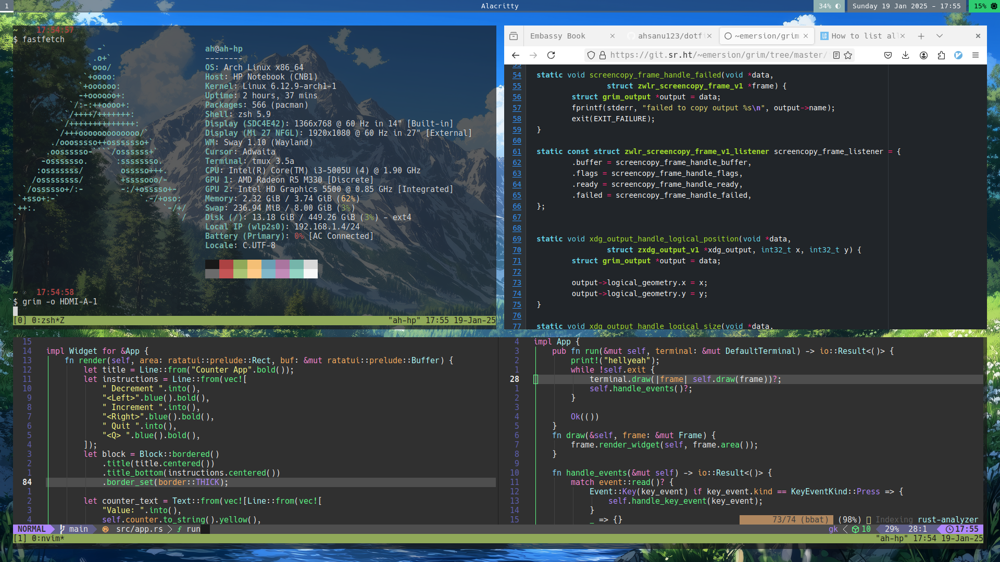

  <b>screenshot</b>

# 💤 Introduction 

config of my wayland archlinux with sway wm. 
make sure to list usefull app name in here (so you don't forget it)

## 🐧 Usefull App

- screenshot -> [grim](https://sr.ht/~emersion/grim/)
- xrandr, x system util
- displaying image -> feh
